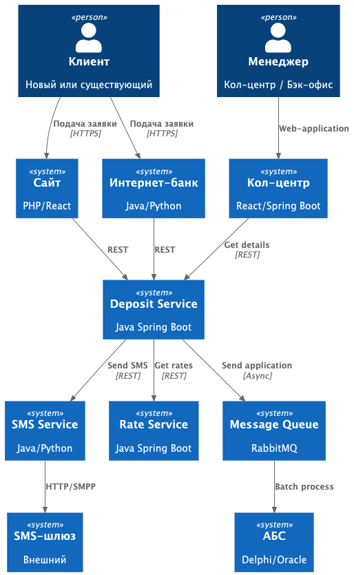
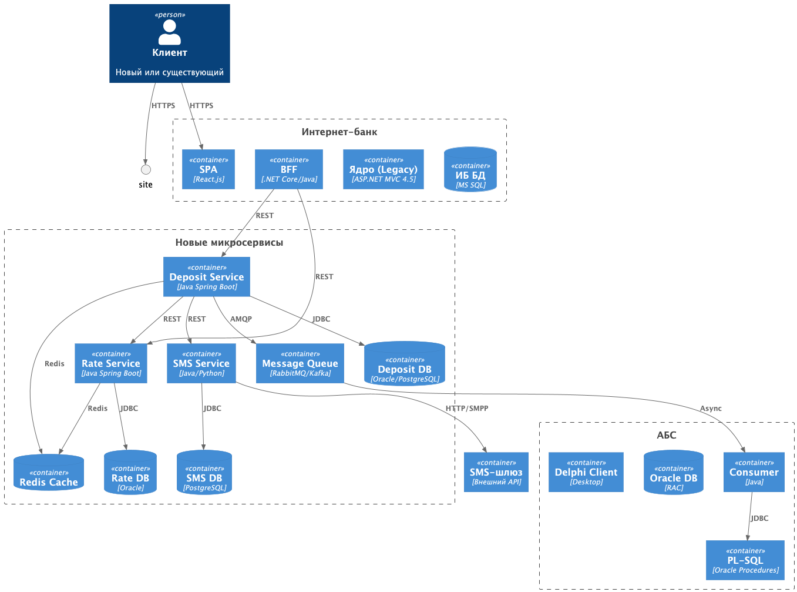

### **Название задачи:** Открытие депозитов онлайн

### **Автор:** Львов А А 
### **Дата:** 6 февраля 2026 года
### **Функциональные требования**

| **№** | **Действующие лица или системы**    | **Use Case** |**Описание**|
|:------|:------------------------------------|:-------------| :- |
| UC-01 | Новый cайт                          | Просмотр ставок по депозитам             |Новый клиент видит на сайте список доступных депозитов с актуальными ставками из централизованного сервиса управления ставками|
| UC-02 | Новый cайт                          | Подача заявки на депозит            |Клиент оставляет ФИО и телефон. Заявка передается в SMS-сервис для уведомления и в очередь заявок для обработки менеджером|
| UC-03 | Существующий клиент / Интернет-банк | Просмотр персонализированных ставок            |Клиент видит базовые и персональные ставки, рассчитанные на основе данных из АБС|
| UC-04 | Существующий клиент / Интернет-банк | Подача заявки на депозит            |Клиент выбирает счет, сумму, подтверждает SMS-кодом. Заявка передается в микросервис депозитов|
| UC-05 | Система кол-центра                  | Обработка заявки нового клиента	         |Менеджер видит заявку, связывается с клиентом, может предложить особые условия|
| UC-06 | Сотрудник бэк-офиса / АБС           | Подтверждение условий депозита          |Сотрудник подтверждает ставку и условия в АБС, запускает процесс открытия депозита|
| UC-07 | SMS-сервис                          | Отправка уведомлений           |Автоматическая отправка SMS при изменении статуса заявки и открытии депозита|
| UC-08 | Сервис управления ставками          | Управление ставками            |Сотрудники бэк-офиса депозитов и кредитов управляют актуальными ставками через административный интерфейс|

### **Нефункциональные требования**

| **№** | **Требование**                                                                                                                                                        |
|:-----:|:----------------------------------------------------------------------------------------------------------------------------------------------------------------------|
|   R   | Надежность                                                                                                                                                            |
|  R1   | Доступность новых микросервисов (Deposit Service, SMS Service, Rate Service) должна составлять 99.9%                                                                  |
|  R2   | Система должна функционировать в режиме 24/7 без остановок на регламентные работы                                                                                     |
|  R3   | Время восстановления после сбоя (Recovery Time Objective) не должно превышать 15 минут                                                                                |
|  R4   | Потери данных при сбое (RPO - Recovery Point Objective) должны составлять 0 секунд (нулевая потеря данных)                                                            |
|  R5   | Сбой или недоступность одного из микросервисов не должен приводить к полной недоступности всего решения                                                               |
|   P   | Производительность                                                                                                                                                    |
|  P1   | Время отклика пользовательского интерфейса при выполнении операций (просмотр ставок, подача заявки) должно составлять не более 100 миллисекунд для 95% запросов (p95) |
|  P2   | Система должна выдерживать пиковую нагрузку 1000 запросов в секунду (RPS) на API новых микросервисов в часы пик                                                       |
|  P3   | Время обработки заявки от момента подачи до передачи в АБС не должно превышать 5 секунд (исключая время обработки в АБС)                                              |
|  P4   | Кэширование справочных данных (ставки, продукты) должно обеспечивать попадание в кэш (cache hit ratio) не менее 90%                                                   |
|  P5   | Время загрузки страниц сайта и интернет-банка должно составлять не более 2 секунд при скорости интернет-соединения 10 Мбит/с                                          |
|   S   | Масштабируемость                                                                                                                                                      |
|  S1   | Новые микросервисы должны поддерживать горизонтальное масштабирование (увеличение количества экземпляров) без изменения кода                                          |
|  S2   | Система должна поддерживать автоматическое масштабирование (auto-scaling) на основе нагрузки (CPU, memory, RPS)                                                       |
|  S3   | База данных новых сервисов должна поддерживать масштабирование (кластеризация, шардирование, read replicas)                                                           |
|  S4   | Интеграция с АБС должна обеспечивать защиту от перегрузки                                                                                                             |
|  +R   | Ограничения                                                                                                                                                           |
|  +R1  | Новые сервисы должны использовать технологии, совместимые с существующими платформами банка                                                                           |
|  +R2  | Предпочтительные языки программирования — Java (основной) или Python (при наличии экспертизы в команде скоринга)                                                      |
|  +R3  | В качестве СУБД для новых сервисов должны использоваться Oracle или PostgreSQL (существующие в банке)                                                                 |
|  +R4  | АБС масштабируется только вертикально — все онлайн-запросы к АБС должны быть исключены или буферизированы                                                             |
|  АЗТ  | АРХИТЕКТУРНО-ЗНАЧИМЫЕ ТРЕБОВАНИЯ (АЗТ)                                                                                                                                |
| АЗТ1  | Выделение SMS-сервиса из ядра интернет-банка для обеспечения независимости от подрядчика                                                                              |
| АЗТ2  | Асинхронная интеграция с АБС через очередь сообщений для защиты от пиковых нагрузок                                                                                   |
| АЗТ3  | Реализация идемпотентности обработки заявок для защиты от дублей при сетевых сбоях.                                                                                   |

### **Подача заявки существующим клиентом**
Клиент → Интернет-банк → Deposit API → SMS Service → Queue → (ACK Клиенту)

* Клиент запрашивает персонализированные ставки
* Deposit API получает ставки из Rate Service (с кэшем)
* Клиент подает заявку с подтверждением по SMS
* Deposit API сохраняет заявку в БД (статус: PENDING)
* Отправка события в очередь для АБС
* Отправка SMS "Заявка принята"

Возврат ID заявки клиенту
### **Описание технологий и логика принятия решения**

|**Компонент**|**Технология**|**Экспертиза в банке**|**Обоснование**|
| :-: | :- | :- | :- |
|Deposit Service|Java 25+ Spring Boot|Команда АБС (Java), Кол-центр|Соответствует требованиям совместимости|
|Rate Service|Java 25+ Spring Boot|Команда АБС|Единый стек, переиспользование экспертизы|
|SMS Service|JPython Flask|Команда скоринга (Python)|Быстрая разработка, существующий опыт|
|БД новых сервисов|Oracle / PostgreSQL| Обе технологии есть в банке|Соответствует требованиям|
|Redis|||Критично для производительности|
|Очереди	RabbitMQ (сущ) / Kafka (нов)||RabbitMQ (кол-центр)	RabbitMQ - существующий, Kafka - перспектива||
|API Gateway|kung||Централизованное управление трафиком|
|Мониторинг|||Необходимо для SLA 99.9%|

### **Решение**
Приведите диаграммы контекста и контейнеров в модели C4. Опишите там основные компоненты и интеграции всех элементов решения.

### **Диаграмма контекста**

### **Диаграмма контейнеров**

Асинхронная обработка заявок создает задержку в несколько секунд/минут, но это приемлемо для бизнес-процесса открытия депозитов и критически важно для защиты АБС.
**Недостатки, ограничения, риски**

| **Риск**                         | **Решение**                                            |
|:---------------------------------|:-------------------------------------------------------|
| Перегрузка АБС при старте        | Постепенное увеличение batch size, throttling          |
| Несовместимость Kafka с .NET 4.5 | Использовать RabbitMQ (уже есть), адаптер REST → Kafka |
| Потеря сообщений при сбое        | Persistent queues, idempotency keys, exactly-once      |
| Vendor lock-in кол-центра        | API фасад, документация для будущей миграции           |

### **Альтернативы**
Заказ разработки подрядчикам и доработка колл-центра. Риски: не прямая зона ответственности банка
