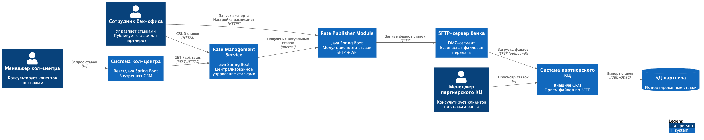
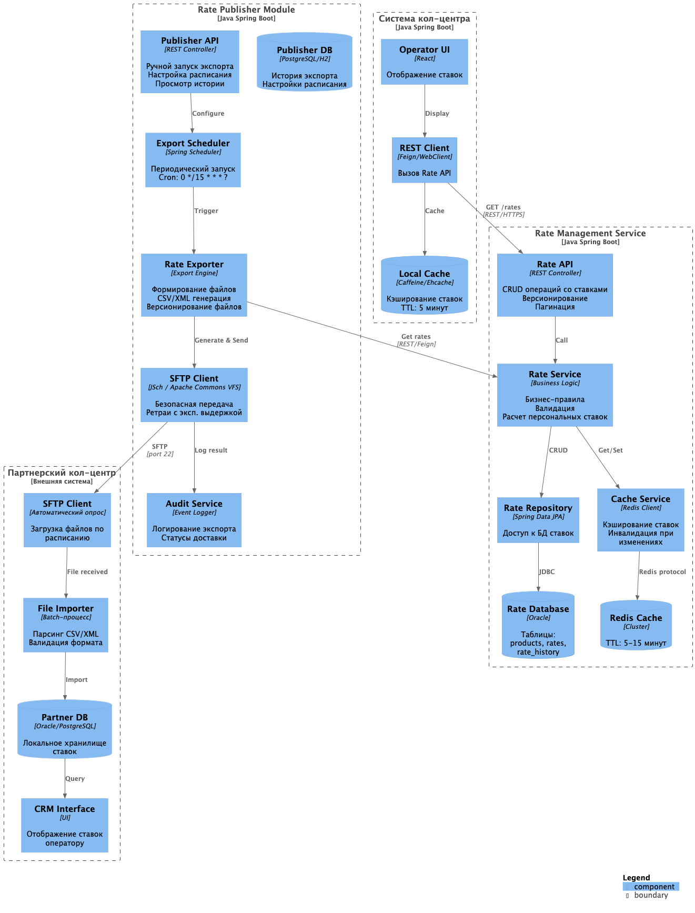
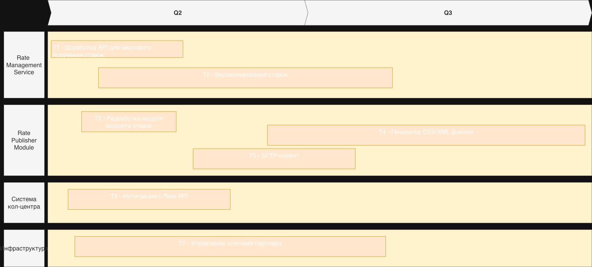

### **Название задачи:** Передача ставок в кол-центр
### **Автор:** Львов А А
### **Дата:** 6 февраля 2026 года

## Архитектурное решение
### Решение
Создать единый механизм публикации ставок, который обеспечит:

* Доступ к ставкам через API для внутренней системы кол-центра (микросервисная архитектура)
* Экспорт ставок в файловый формат для внешнего партнерского кол-центра (SFTP)
* Централизованное управление через существующий Rate Management Service

### Обоснование
* Единый источник истины - ставки управляются централизованно, исключается рассинхронизация
* Минимизация доработок - используется уже спроектированный Rate Management Service
* Учет ограничений партнера - файловый обмен вместо API (требование партнера)
* Быстрое внедрение - SFTP-протокол стандартен, файловые форматы просты в реализации
* Масштабирование поддержки - снятие нагрузки с внутреннего кол-центра за счет партнера

### Недостатки решения
* Задержка актуализации ставок при файловом обмене (не real-time)
* Необходимость синхронизации версий файловых форматов с партнером
* Отсутствие гарантий доставки и подтверждения применения ставок у партнера
* Ручное или полуавтоматическое управление SFTP-доступом

### Альтернативы, которые рассматривались
* Предоставить партнеру защищенный REST API
* Бэк-офис вручную отправляет файлы по email. Неприемлемо для масштабирования, high-touch
* Дать партнеру read-only доступ к БД ставок. Неприемлемо, тк это нарушение безопасности, невозможность контроля

### **Функциональные требования**

| **№** | **Действующие лица или системы**                                                                                                           | **Use Case** | **Описание** |
|:------|:-------------------------------------------------------------------------------------------------------------------------------------------|:-------------|:-------------|
| FR-01 | Система должна предоставлять REST API для получения актуальных ставок по депозитам внутренней системе кол-центра                           |              |              |
| FR-02 | API должно поддерживать фильтрацию ставок по типу продукта, дате активности, категории клиента                                             |              |              |
| FR-03 | Должна быть предусмотрена возможность ручного запуска экспорта ставок через административный интерфейс                                     |              |              |
| FR-04 | Система должна вести аудит всех операций экспорта: время запуска, количество записей, статус передачи, ошибки                              |              |              |
| FR-05 | Для внутренней системы кол-центра должно быть реализовано кэширование ставок с TTL не более 15 минут для снижения нагрузки на Rate Service |              |              |
| FR-06 | При изменении ставок в Rate Service должна автоматически производиться инвалидация кэша в Redis                                            |              |              |
| FR-06 | Система должна отправлять уведомления ответственным сотрудникам при сбоях экспорта (отсутствие файла, ошибка SFTP)                         |              |              |

### **Нефункциональные требования**
| **№** | **Требование**                                                                                                  |
|:-----:|:----------------------------------------------------------------------------------------------------------------|
|   R   | Надежность                                                                                                      |
|  R1   | Доступность Rate Service для внутреннего кол-центра                                                             |
|  R2   | Доступность SFTP-сервера для партнера                                                                           |
|  R3   | Система должна автоматически ретраить отправку файлов при сбое SFTP (до 3 попыток с экспоненциальной задержкой) |
|  R4   | При недоступности SFTP файлы должны сохраняться локально до восстановления связи                                |
|   P   | Производительность                                                                                              |
|  P1   | Время ответа API ставок для внутреннего кол-центра (p95)                                                        |
|  P2   | Время генерации файла экспорта при 1000+ записей                                                                |
|  P3   | Пропускная способность API ставок                                                                               |
|  P4   | Кэширование ставок должно обеспечивать hit rate                                                                 |
|  P5   | Время загрузки виджета ставок в CRM оператора                                                                   |
|   S   | Масштабируемость                                                                                                |
|  S1   | 	Rate Publisher должен поддерживать горизонтальное масштабирование                                              |
|  S2   | Количество одновременно подключаемых партнеров (SFTP) не менее 10                                               |
|  S3   | 	API ставок должно масштабироваться горизонтально                                                               |
|  S4   | Система должна поддерживать экспорт для 100+ продуктов без деградации                                           |
|   R   | Ограничения                                                                                                     |
|  R1   | Новый модуль экспорта должен разрабатываться на Java Spring Boot (как и Rate Service)                           |
|  R2   | Файловый формат должен быть согласован с партнером до начала разработки                                         |

Опишите здесь верхнеуровневые Use Cases. Их нужно оформить в виде таблицы с пошаговым описанием:

| **№** | **Действующие лица или системы** | **Use Case**                   | **Описание**                                                                                 |
|:-----:|:---------------------------------|:-------------------------------|:---------------------------------------------------------------------------------------------|
|  UC1  | Менеджер внутреннего кол-центра  | Консультирование по ставкам    | Менеджер видит актуальные ставки по депозитам в интерфейсе CRM для консультирования клиентов |
|  UC2  | Менеджер партнерского кол-центра | Консультирование по ставкам    | Внешний партнер получает актуальные ставки для консультирования клиентов банка               |
|  UC3  | Сотрудник бэк-офиса              | Публикация ставок для партнера | Единый процесс публикации ставок одновременно для внутренних и внешних потребителей          |
|  UC4  | Система партнерского кол-центра  | Прием файлов со ставками       | Получение ставок по SFTP в согласованном формате (CSV/XML)                                   |

### **Диаграмма контекста**

### **Диаграмма компонентов**

### Список крупных задач для каждой системы

 #### Задачи для IT-отдела
| **№** | **Система** | Задача** | **Описание** |
|:-----:|:------------|:---------|:-------------|
|  T1   | Rate Management Service        | Доработка API для массового получения ставок      | Добавить endpoint /api/rates/export с фильтрацией и пагинацией для эффективного экспорта всех ставок          |
|  T2   | Rate Management Service        | Версионирование ставок      | Доработать модель данных для хранения истории изменений ставок с effective_from/effective_to          |
|  T3   | Rate Publisher Module        | 	Разработка модуля экспорта ставок      | Создать новый микросервис/модуль для экспорта ставок в файлы          |
|  T4   | Rate Publisher Module        | Генератор CSV/XML файлов      | Реализация формирования файлов в согласованном формате          |
|  T5   | Rate Publisher Module        | 	SFTP-клиент      | 	Интеграция с SFTP-сервером, ретраи, логирование          |
|  T6   | Система кол-центра        | 	Интеграция с Rate API     | 		Разработка/доработка REST-клиента для получения ставок        |
|  T7   | Инфраструктура        | 	Управление ключами партнера      | 	Генерация ключей, настройка доступа только в upload-каталог         |
#### Задачи для бэк-офиса
| **№** | Задача**                   | **Описание**                                                |
|:-----:|:---------------------------|:------------------------------------------------------------|
|  T8   | 	Определение формата файла | Согласование с партнером структуры CSV/XML, версионирования |
|  T9   | Согласование регламента    | Частота обновления, ответственность за сбои, SLA            |

#### Задачи для партнера
| **№** | Задача**                | **Описание**                                                    |
|:-----:|:------------------------|:----------------------------------------------------------------|
|  T10  | 	Настройка SFTP-клиента | Обеспечение автоматической загрузки файлов с SFTP-сервера банка |
|  T11  | Разработка импортера    | Парсинг CSV/XML, загрузка в БД партнера                         |

### Roadmap

