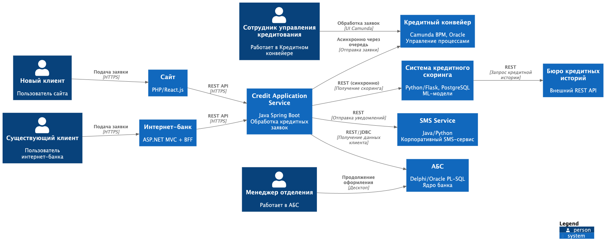
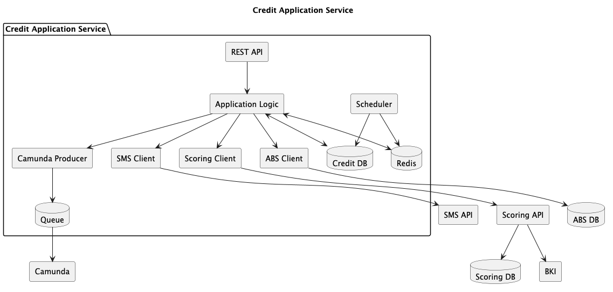

### **Название задачи:** Заявка на кредит онлайн
### **Автор:** Львов А А
### **Дата:** 6 февраля 2026 года

## Архитектурное решение
### Решение

Создать Credit Application Service - новый микросервис для обработки кредитных заявок, интегрирующий:
* Кредитный конвейер (Camunda) - управление бизнес-процессами кредитования
* Систему скоринга (Python/Flask) - расчет кредитного рейтинга
* АБС - данные о клиентах и счетах
* SMS-сервис - уведомления клиентов

Использовать асинхронную интеграцию с Кредитным конвейером (очередь сообщений) для защиты от пиковых нагрузок, но при этом обеспечить синхронный скоринг для мгновенного предварительного решения.

### Обоснование
* Мгновенное предварительное решение - синхронный вызов скоринга для новых клиентов с паспортными данными
* Защита существующих систем - асинхронная отправка заявок в Кредитный конвейер (текущий режим "раз в сутки" недопустим)
* Переиспользование компонентов - SMS-сервис уже разработан для депозитного процесса
* Единый источник заявок - централизованное хранение статусов заявок из всех каналов
* Сквозная трассировка - единый идентификатор заявки для сайта, ИБ, Кредитного конвейера и АБС

###  Недостатки решения
* Дополнительная задержка при синхронном скоринге (запрос в БКИ)
* Риск устаревания предодобренных предложений (необходим периодический пересчет)
* Дополнительная нагрузка на Систему скоринга в часы пик

### Альтернативы решения
* Прямая интеграция сайта с Кредитным конвейером
Недостатки: нет синхронного скоринга , нет хранения заявок , нет единого статуса

### **Функциональные требования**

| **№** | **Действующие лица или системы**                                                                                 | **Use Case**                                    | **Описание** |
|:------|:-----------------------------------------------------------------------------------------------------------------|:------------------------------------------------|:-------------|
| FR01  | Система должна предоставлять REST API для получения кредитных предложений на сайте и в интернет-банке            | Просмотр кредитных предложений                  |              |
| FR02  | API должно возвращать базовые условия для новых клиентов и персонализированные (предодобренные) для существующих | Просмотр кредитных предложений                  |              |
| FR03  | Система должна принимать заявки на кредит из сайта и интернет-банка                                              | Подача заявки на кредит (с паспортными данными) |              |
| FR04  | Система должна сохранять все заявки в собственном хранилище с уникальным идентификатором                         |                                                 |              |
| FR05  | Заявки должны асинхронно передаваться в Кредитный конвейер (Camunda) для дальнейшей обработки                    |                                                 |              |

### **Нефункциональные требования**

| **№** | **Требование**                                                 |
|:-----:|:---------------------------------------------------------------|
|   R   | Надежность                                                     |
|  R1   | Доступность Credit Application Service                         |
|  R2   | Доступность интеграции с БКИ                                   |
|  R3   | Количество повторных попыток при сбое интеграций 3             |
|  R4   | Dead Letter Queue для необработанных заявок                    |
|  R5   | Автоматическое переключение на резервный ЦОД                   |
|   P   | Производительность                                             |
|  P1   | Время ответа API кредитных предложений < 100 ms                |
|  P2   | Пропускная способность API заявок 500 rps                      |
|  P3   | Время асинхронной передачи заявки в Кредитный конвейер < 5 sec |
|  P4   | Кэширование предодобренных предложений                         |
|   S   | Масштабируемость                                               |
|  S1   | Горизонтальное масштабирование Credit Service до 20+ инстансов |
|  S2   | БД должна поддерживать шардирование                            |
|   R   | Ограничения                                                                                                     |
|  R1   | Credit Service разрабатывается на Java Spring Boot                                                                                                     |
|  R2   | БД - Oracle или PostgreSQL                                                                                                     |

### **Архитектурно-значимые требования**

| **№** | **Требование**                                                                | **Обоснование**                                                 |
|:------|:------------------------------------------------------------------------------|:----------------------------------------------------------------|
| АЗТ1  | Создание отдельного Credit Application Service для обработки кредитных заявок |                                                                 |
| АЗТ2  | Асинхронная передача заявок в Кредитный конвейер                              | Защита Camunda от пиковых нагрузок, возможность batch-обработки |
| АЗТ3  | Единый идентификатор заявки (CreditApplicationId) сквозь все системы          | Сквозная трассировка, связывание заявки на сайте и в АБС        |
| АЗТ4  | Интеграция с SMS-сервисом (существующим)                                      | Переиспользование компонента, экономия ресурсов                 |
| АЗТ5  | 	Идемпотентность создания заявок (idempotency key)                            | Защита от дублей при повторной отправке                         |

### **Ограничения решения**

| **№** | **Ограничение**                                   | **Описание**                              | **Влияние**                                                                                      |
|:------|:--------------------------------------------------|:------------------------------------------|:-------------------------------------------------------------------------------------------------|
| R1    | Кредитный конвейер обновляется раз в сутки из АБС | Текущий режим пакетной загрузки           | Необходимо обеспечить прием заявок 24/7 через Credit Service, Camunda получает заявки асинхронно |
| R2    | АБС масштабируется только вертикально             | Невозможно горизонтальное масштабирование | Все синхронные запросы к АБС минимизированы (только чтение данных клиента)                       |
| R3    | БКИ имеет лимиты на количество запросов           | Платная услуга, ограничения по RPS        | Кэширование результатов скоринга, упрощенный скоринг без БКИ для предодобренных   

### **Диаграмма контекста**

### **Диаграмма компонентов**
